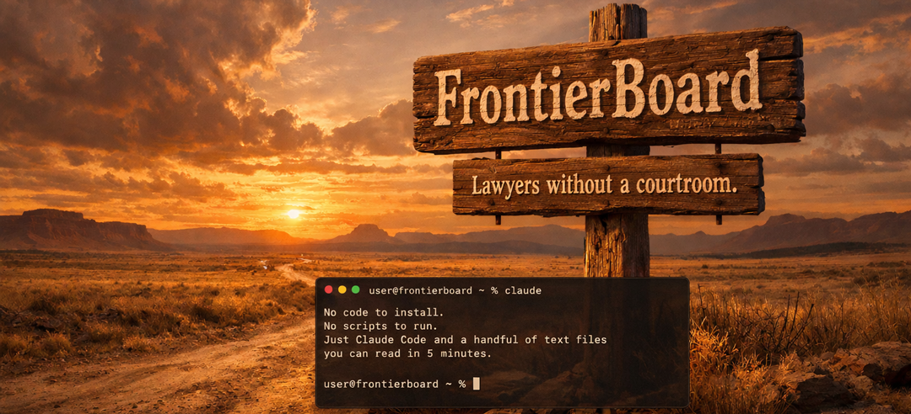
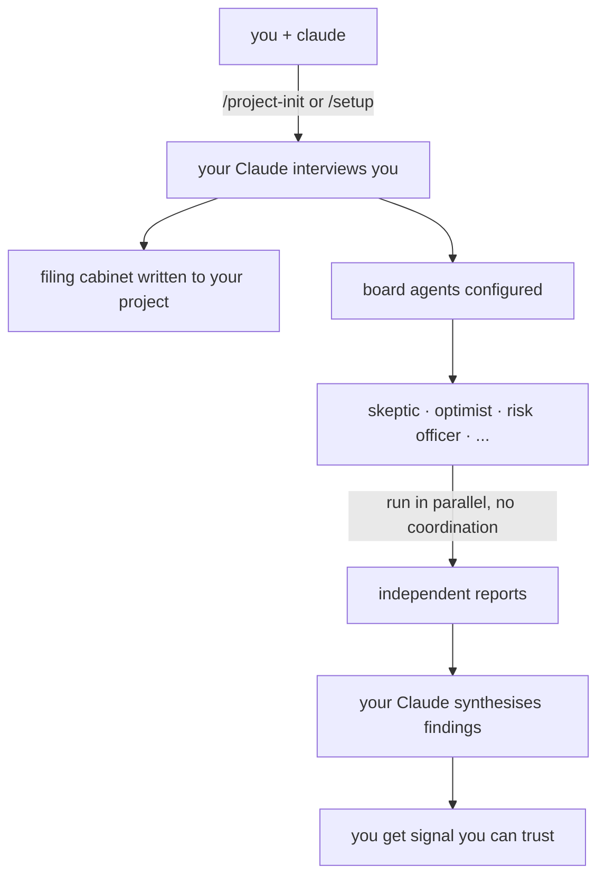

<div align="center">

# FrontierBoard



[](LICENSE)
[](https://claude.ai/code)
[](#the-skills)
[](#requirements)
[](https://github.com/stefans71/FrontierBoard/discussions)

**A governance board of frontier model agents — independent, parallel, ruthlessly honest.**

*Your Claude sets it up. Your Claude runs it. FrontierBoard is just the instructions it reads.*

---

[Get Started](#getting-started) · [Two Ways to Use It](#two-ways-to-use-frontierboard) · [How It Works](#how-it-works) · [The Skills](#the-skills) · [Philosophy](#philosophy)

</div>

---

## What It Is

FrontierBoard gives any project an independent review board made of AI agents. Each agent is a frontier model CLI — Claude, Codex, Qwen, or any other — running in its own isolated directory with its own settings. They don't coordinate. They don't see each other's work. They review independently, write their reports, and your Claude synthesises the findings.

Point it at code, architecture, a business decision, a hiring brief, a financial model. The board has no fixed domain. You bring the question. The board brings the perspectives.

---

## Getting Started

You need Claude Code. Everything else gets sorted during setup.

**Clone FrontierBoard into your project folder** — not alongside it, not somewhere separate. FrontierBoard is a tool that lives inside the project you're working on.

```bash
# Step 1: Open a terminal in your project folder
cd /path/to/your-project

# Step 2: Clone FrontierBoard as a subfolder and gitignore it
git clone https://github.com/stefans71/FrontierBoard
echo "FrontierBoard/" >> .gitignore

# Step 3: Run claude from inside FrontierBoard
# (This is the only reason you cd here — so Claude picks up the skills)
cd FrontierBoard
claude
```

Then type `/project-init` or `/setup` — see [Two Ways to Use It](#two-ways-to-use-frontierboard) to pick the right one.

Everything the board installs — agent directories, the `.board/` folder, review logs — goes **one level up**, back into your project root. After setup you won't need to `cd FrontierBoard` again.

---

## Two Ways to Use FrontierBoard

### 🗂️ `/project-init` — Filing cabinet + board *(recommended)*

> *An improvising Claude, left alone in a new codebase, produces the kind of file structure that looks like a 5-year-old was left unsupervised in your office for an hour.*

Before you write a line of code, your Claude interviews you and builds the four files that keep it sane across every session:

| File | What it does |
|------|-------------|
| `.claude/settings.json` | Guardrails before anything runs. Deny list tailored to your stack. |
| `CLAUDE.md` | Under 150 lines. Identity, not a knowledge dump. |
| `SPEC.md` | Architecture from the interview — not a template. |
| `tasks.md` | Survives compaction. Phase boundaries. Keeps your project from losing its place. |

Your Claude detects whether this is a new project or an existing one and takes the right path. For existing projects it scans first, confirms what it found, and only fills in what's missing — it won't overwrite anything already there.

Optionally wires in the board at the end. Everything lands in `[your-project]/.board/` — gitignored, separate from your project, no collisions.

```bash
# From inside your project folder:
cd FrontierBoard && claude
# type /project-init
```

---

### 🏛️ `/setup` — Just the board

Already have your project set up? Your Claude interviews you, reads your project, builds the agents, and installs the board into `[your-project]/.board/`.

```bash
# From inside your project folder:
cd FrontierBoard && claude
# type /setup
```

---

## How It Works



Each agent runs from its own directory. That directory contains a settings file for that agent's CLI. When the CLI starts, it finds that local settings file first — and stops walking up the tree. Your project config, your interactive session, your other agents — none of it bleeds through.

Your project Claude can request a board review without you opening a second terminal. It writes a brief, shells out, the agents run in parallel, and it reads the synthesis back to you.

---

## The Skills

| Command | What your Claude does |
|---------|----------------------|
| `/project-init` | Interviews you · writes the filing cabinet · optionally wires in the board · works for new and existing projects |
| `/setup` | Builds your board from scratch — reads your project, sets up agents, handles CLI auth |
| `/brief` | Sets context for a review — detects domain, writes or activates context, populates inboxes |
| `/run` | Runs all agents in parallel · collects reports · synthesises findings |
| `/new-agent` | Adds a new agent to the board — same conversational flow |

Plain language always works. The slash commands are shortcuts.

---

## What Gets Committed vs What Lives Locally

The repo contains only the seed — skill files and an empty board directory. Everything generated lives locally and is gitignored:

- Agent directories and their settings bubbles
- Agent identities and domain contexts
- Review briefs, reports, and the review log
- Your filing cabinet (`SPEC.md`, `tasks.md`, `settings.json`)

The repo stays minimal. Your board is yours.

---

## Requirements

- **[Claude Code](https://claude.ai/code)** — required. This is how you interact with the board.
- **Frontier model CLIs** — installed by your Claude during `/setup` as needed:
  - `claude` — Claude Code (Anthropic)
  - `codex` — Codex CLI (OpenAI) · [github.com/openai/codex](https://github.com/openai/codex)
  - `qwen` — Qwen Code (Alibaba) · [github.com/QwenLM/qwen-code](https://github.com/QwenLM/qwen-code)
  - Any other frontier CLI that supports a local settings file

---

## Philosophy

FrontierBoard is built on a philosophy pioneered by **Gavriel** and the contributors of [NanoClaw](https://github.com/qwibitai/NanoClaw):

> *Small enough to understand. AI-native. Claude Code is the installer, the runtime, and the operator.*

No framework. No wizard. No dependency tree. No code that runs before you trust it. Just your Claude reading a skill file and doing the work — asking questions, fixing problems, building things from your answers.

FrontierBoard applies that to a governance problem: independent agents, independent perspectives, independent reports. A system designed to find what one model misses, to surface disagreement, to give you signal you can trust because no single model produced it alone.

**The board is lawyers without a courtroom.** It has no opinions about what you're reviewing. You bring the question. The board brings the perspectives.

---

## Tribute

FrontierBoard would not exist without **Gavriel** ([qwibitai](https://github.com/qwibitai)) and the NanoClaw contributors — Vaibhav Aggarwal, Skip Potter, Rafael Garcia, Lingfeng Guan, and others.

If you haven't read NanoClaw, [read it](https://github.com/qwibitai/NanoClaw). It will change how you think about what a software project can be.

---

<div align="center">

*MIT License · [Discussions](https://github.com/stefans71/FrontierBoard/discussions) · [Report an Issue](https://github.com/stefans71/FrontierBoard/issues)*

</div>
