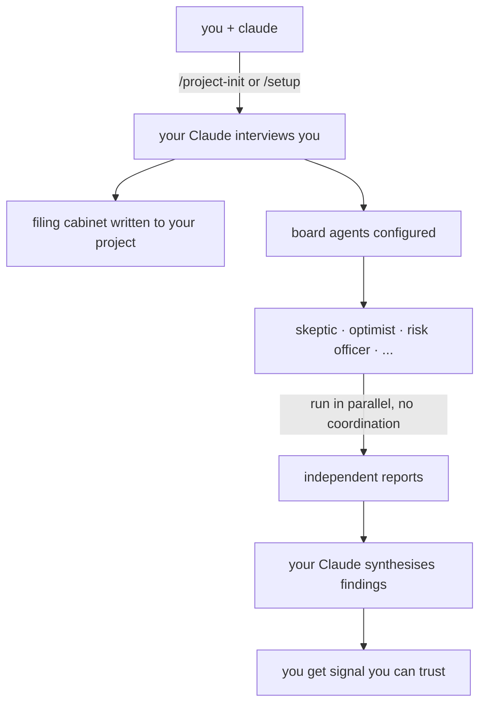

<div align="center">

# FrontierBoard


[](LICENSE)
[](https://claude.ai/code)
[](#the-skills)
[](#requirements)
[](https://github.com/stefans71/FrontierBoard/discussions)

**A governance board of frontier model agents — independent, parallel, ruthlessly honest.**

*Your Claude sets it up. Your Claude runs it. FrontierBoard is just the instructions it reads.*

---

[Get Started](#getting-started) · [Four Ways to Use It](#four-ways-to-use-frontierboard) · [How It Works](#how-it-works) · [The Skills](#the-skills) · [Philosophy](#philosophy)

</div>

---

## What It Is

FrontierBoard gives any project an independent review board made of AI agents. Each agent is a frontier model CLI — Claude, Codex, Qwen, or any other — running in its own directory with its own settings. They don't coordinate. They don't see each other's work. They review independently, write their reports, and your Claude synthesises the findings.

> **Note:** In the current version (v1), blind review is enforced by agent instructions, not by technical isolation. Agents run as the same user and could theoretically access each other's directories. Container-based isolation is [planned for v2](docs/ROADMAP-CONTAINER-ISOLATION.md).

Point it at code, architecture, a business decision, a hiring brief, a financial model. The board has no fixed domain. You bring the question. The board brings the perspectives.

---

## Getting Started

You need [Claude Code](https://claude.ai/code). That's it.

Open Claude Code and say:

    Set up FrontierBoard: https://github.com/stefans71/FrontierBoard/blob/main/README.md

Claude reads the install instructions on that page and walks you through everything:

- **New project?** Claude asks for a name, creates the folder, sets up your
  filing cabinet, and optionally adds a review board.
- **Existing project?** Claude asks for the path, reads your project, and
  sets up the board.
- **Just want to review a GitHub repo?** Claude clones FrontierBoard, then
  runs `/review-release` — no project folder needed.
- **Want it everywhere?** Install globally once, then run board reviews from
  any project without re-cloning.

You never clone anything yourself. Claude handles it.

---

## Four Ways to Use FrontierBoard

### New project — filing cabinet + board

> *An improvising Claude, left alone in a new codebase, produces the kind of file structure that looks like a 5-year-old was left unsupervised in your office for an hour.*

Claude interviews you and builds the four files that keep it sane across every session:

| File | What it does |
|------|-------------|
| `.claude/settings.json` | Guardrails before anything runs. Deny list tailored to your stack. |
| `CLAUDE.md` | Under 150 lines. Identity, not a knowledge dump. |
| `SPEC.md` | Architecture from the interview — not a template. |
| `tasks.md` | Survives compaction. Phase boundaries. Keeps your project from losing its place. |

Works for new and existing projects. For existing projects it scans first, confirms what it found, and only fills in what's missing. Optionally wires in the review board at the end.

---

### Existing project — just the board

Already have your project set up? Claude interviews you about your review needs, reads the project, builds the agents, and installs the board. Everything is conversational — Claude asks the questions, you answer, Claude does the work.

---

### Review a GitHub repo — no project needed

Just want to review someone else's code before installing it, or find bugs to contribute? No project folder needed. Three review modes:

- **Mode A** — Static release review: find bugs and improvements in a diff
- **Mode B** — Safety review: is this repo safe to install?
- **Mode C** — Full build review: clone it, install it, capture what breaks

---

### Global install — one board for all your projects

Install FrontierBoard once at `~/.frontierboard/`. Then run board reviews from any project — no per-project cloning needed. The global board keeps a separate workspace for each project it reviews, so nothing bleeds between them.

Good for developers who work across many repos and want a standing review board available everywhere.

---

## How It Works



Each agent runs from its own directory. That directory contains a settings file for that agent's CLI. When the CLI starts, it finds that local settings file first — and stops walking up the tree. Your project config, your interactive session, your other agents — the settings don't bleed through.

Your project Claude can request a board review without you opening a second terminal. It writes a brief, shells out, the agents run in parallel, and it reads the synthesis back to you.

---

## The Skills

| Command | What your Claude does |
|---------|----------------------|
| `/project-init` | Interviews you · writes the filing cabinet · optionally wires in the board · works for new and existing projects |
| `/setup` | Builds your board from scratch — reads your project, sets up agents, handles CLI auth |
| `/brief` | Sets context for a review — detects domain, writes or activates context, populates inboxes |
| `/run` | Runs all agents in parallel · collects reports · synthesises findings |
| `/review-release` | Reviews a GitHub repo or release — static analysis, safety verdict, or full build monitoring |
| `/new-agent` | Adds a new agent to the board — same conversational flow |
| `/agents-yolo` | Toggles YOLO (full autonomy) vs supervised mode for all agents |

Plain language always works. The slash commands are shortcuts.

---

## What Gets Committed vs What Lives Locally

The repo contains only the seed — skill files and an empty board directory. Everything generated lives locally and is gitignored:

- Agent directories and their settings bubbles
- Agent identities and domain contexts
- Review briefs, reports, and the review log
- Your filing cabinet (`SPEC.md`, `tasks.md`, `settings.json`)

The repo stays minimal. Your board is yours.

---

## Requirements

- **[Claude Code](https://claude.ai/code)** — required. This is how you interact with the board.
- **Docker** — recommended for container isolation mode. Agents run in isolated containers with no access to each other or your filesystem. Setup installs Docker if needed.
- **Frontier model CLIs** — installed by your Claude during `/setup` as needed:
  - `claude` — Claude Code (Anthropic)
  - `codex` — Codex CLI (OpenAI) · [github.com/openai/codex](https://github.com/openai/codex)
  - `qwen` — Qwen Code (Alibaba) · [github.com/QwenLM/qwen-code](https://github.com/QwenLM/qwen-code)
  - Any other frontier CLI that supports a local settings file

---

## Philosophy

FrontierBoard is built on a philosophy pioneered by **Gavriel** and the contributors of [NanoClaw](https://github.com/qwibitai/NanoClaw):

> *Small enough to understand. AI-native. Claude Code is the installer, the runtime, and the operator.*

No framework. No wizard. No dependency tree. No code that runs before you trust it. Just your Claude reading a skill file and doing the work — asking questions, fixing problems, building things from your answers.

FrontierBoard applies that to a governance problem: independent agents, independent perspectives, independent reports. A system designed to find what one model misses, to surface disagreement, to give you signal you can trust because no single model produced it alone.

**The board is lawyers without a courtroom.** It has no opinions about what you're reviewing. You bring the question. The board brings the perspectives.

---

## Tribute

FrontierBoard would not exist without **Gavriel** ([qwibitai](https://github.com/qwibitai)) and the NanoClaw contributors — Vaibhav Aggarwal, Skip Potter, Rafael Garcia, Lingfeng Guan, and others.

If you haven't read NanoClaw, [read it](https://github.com/qwibitai/NanoClaw). It will change how you think about what a software project can be.

---

## For Claude — Install Instructions

**STOP.** When a user gives you this URL or asks you to set up FrontierBoard:
- Do NOT explore the repo via GitHub API
- Do NOT fetch files with `gh api` or `base64 -d`
- Do NOT spawn agents to read skill files
- Just follow the four steps below, in order

### 1. Ask what they need (do this FIRST — before any other action)

Say exactly this:

> Are you using FrontierBoard with a new project or an existing one?
>
> 1. **New project** — I'll create the project folder and set everything up
> 2. **Existing project** — tell me the path and I'll add a review board
> 3. **Just review a GitHub repo** — no project needed
> 4. **Global install** — install once, review any project from anywhere

**Wait for their answer. Do not clone, fetch, or explore anything until they respond.**

### 2. Clone FrontierBoard (one command)

Clone as a neighboring directory in the same parent — never inside the project. AI CLIs walk up the
directory tree for settings files, so FrontierBoard must be a neighbor, not a child,
to keep agent settings isolated.

New project (e.g. user said "myapp" at `~/`):
```bash
mkdir -p ~/myapp
git clone https://github.com/stefans71/FrontierBoard ~/myapp-board/FrontierBoard
```

Existing project (e.g. at `~/myapp`):
```bash
git clone https://github.com/stefans71/FrontierBoard ~/myapp-board/FrontierBoard
```

Just reviewing (no project):
```bash
git clone https://github.com/stefans71/FrontierBoard /tmp/fb-review/FrontierBoard
```

Global install:
```bash
git clone https://github.com/stefans71/FrontierBoard ~/.frontierboard/FrontierBoard
```

### 3. Read the local skill file and follow it

Read from the clone you just created (not from GitHub):

- **New project** → read `[clone-path]/CLAUDE.md`, then follow `[clone-path]/.claude/skills/project-init/SKILL.md`
- **Existing project** → read `[clone-path]/CLAUDE.md`, then follow `[clone-path]/.claude/skills/setup/SKILL.md`
- **Review a repo** → read `[clone-path]/CLAUDE.md`, then follow `[clone-path]/.claude/skills/setup/SKILL.md` first (agents need to exist before reviewing). Once setup completes, follow `[clone-path]/.claude/skills/review-release/SKILL.md`
- **Global install** → read `[clone-path]/CLAUDE.md`, then follow `[clone-path]/.claude/skills/setup/SKILL.md` — setup detects global mode automatically and asks which project to review first

**IMPORTANT — working directory:** The skill files assume the FrontierBoard clone directory
is the working directory. When the skill references `$PROJ` or creates `.board/`, that means
the clone path (e.g. `~/myapp-board/FrontierBoard/`), NOT the user's project directory.
All board files — agents, contexts, briefs, reports — go inside the clone directory.
The user's project directory is never written to by the board.

### 4. Hand off

When done, tell the user:

> Your board is ready at `[board-path]`.
> To start a session: `cd [board-path] && claude`

For global installs, also install a global skill so the user can type `/frontierboard` from any project:

Create `~/.claude/skills/frontierboard/SKILL.md` that shells out to the global FrontierBoard install, passing the current working directory as the project path. This lets the user trigger board reviews from any Claude session without switching directories.

---

<div align="center">

*MIT License · [Discussions](https://github.com/stefans71/FrontierBoard/discussions) · [Report an Issue](https://github.com/stefans71/FrontierBoard/issues)*

</div>
