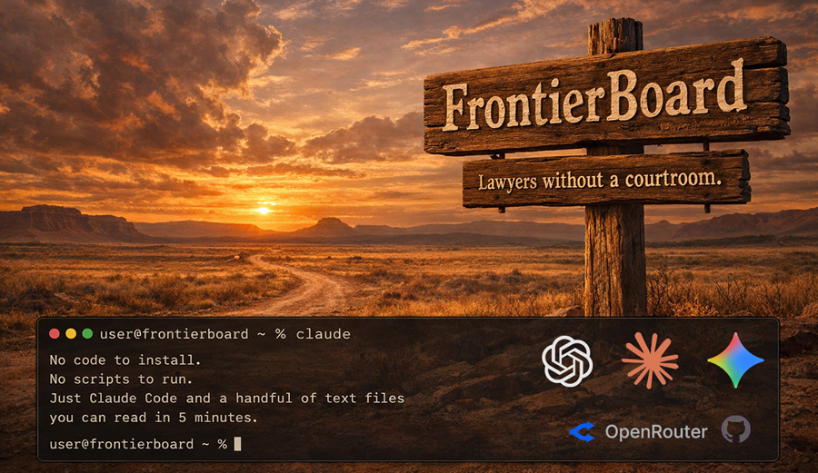
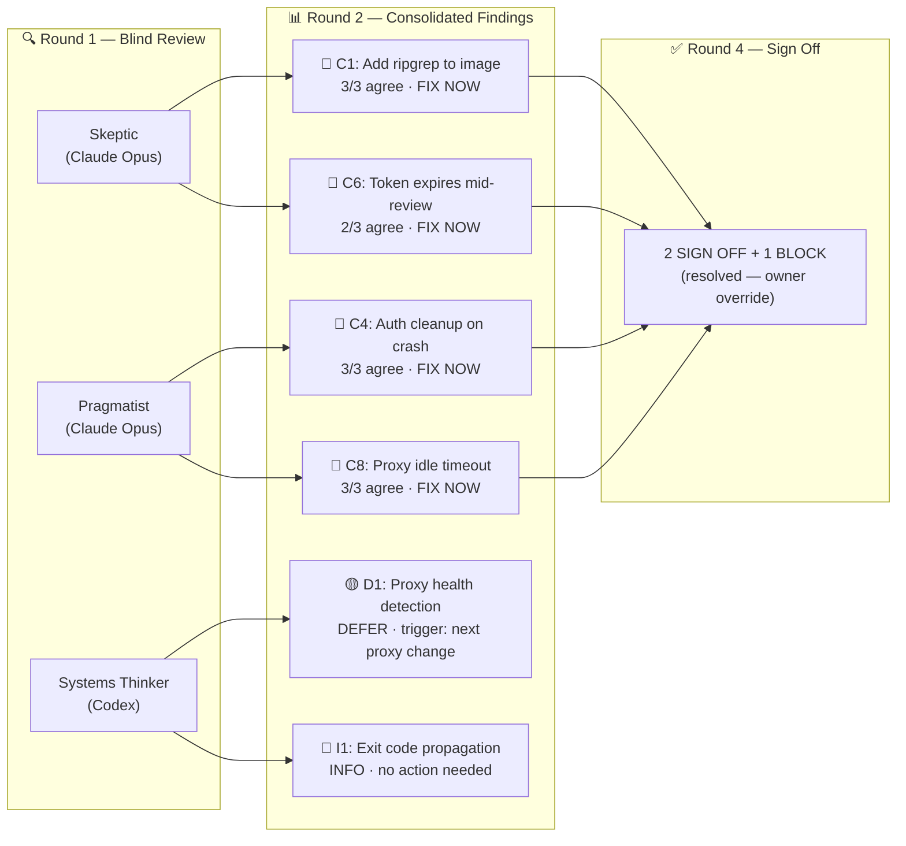
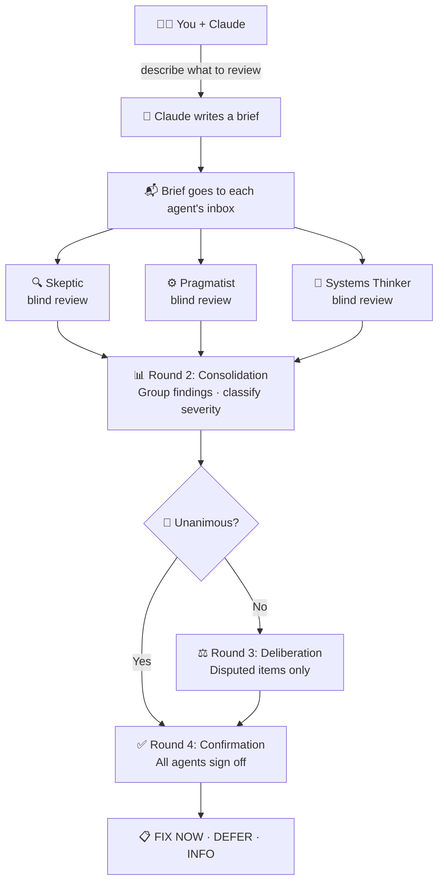

# FrontierBoard — Claude, Codex, Gemini + Together

<div align="center">




<br>

&nbsp;&nbsp;&nbsp;&nbsp;&nbsp;&nbsp;&nbsp;&nbsp;&nbsp;&nbsp;&nbsp;&nbsp;

<br>

### Independent AI agents review your work in parallel.<br>None of them see what the others wrote.<br>Your Claude tells you what they agree on — and where they don't.

<br>

*Your Claude sets it up. Your Claude runs it. FrontierBoard is just the instructions it reads.*

<br>

[30-Second Install](#-getting-started) · [See It Work](#-what-you-get) · [How It Works](#-how-it-works) · [The Skills](#-the-skills)

---

> **This project was reviewed by its own board** — three agents found 10 critical issues across credential handling and review process integrity. All fixed. [See the review.](docs/tasks/FB-000-oauth-credential-fix.yaml)

</div>

<br>

## 

One model reviewing your code catches some things.

The same model reviewing it three times catches **similar things three times**.

Three *different* models — each with a different thinking style, running independently, unable to see each other's work — catch **different things**.

Disagreements are signal, not noise.

> *You pick which models sit on your board. You pick how many.<br>You bring the question. The board brings the perspectives.*

<br>

---

<br>

## 

Real output from a board review of FrontierBoard's own architecture:



<br>

**10 findings. 6 FIX NOW. 2 DEFER. 2 INFO.** All implemented, smoke-tested, and shipped.

Each finding has a severity, agent consensus, and a concrete fix. Agents that disagree get deliberation rounds. The whole process follows a [4-round SOP](docs/REVIEW-SOP.md).

<br>

**Just describe what you want reviewed — Claude handles the rest:**

```
You: "Review the auth handling changes"

Claude: [writes brief, runs 3 agents in parallel]

Claude: "3 agents found 10 issues. 6 are FIX NOW (all agree),
         2 are DEFER (with triggers), 2 are INFO."

You: "Fix the FIX NOW items"

Claude: [implements fixes, sends diff back to the board for code review]
```

No special commands needed. Plain language always works. Slash commands are shortcuts.

<br>

---

<br>

## 

You need [Claude Code](https://claude.ai/code). That's it.

Open Claude Code and say:

```
Set up FrontierBoard: https://github.com/stefans71/FrontierBoard/blob/main/docs/INSTALL.md
```

Claude reads the install instructions and walks you through everything:

| Option | What happens |
|--------|-------------|
| **New project** | Creates the folder, interviews you, sets up a filing cabinet + review board |
| **Existing project** | Reads your project, builds the board as a neighbor directory |
| **Review a GitHub repo** | No project needed — static analysis, safety verdict, or full build review |
| **Global install** | Install once at `~/.frontierboard/`, review any project from anywhere |

You never clone anything yourself. Claude handles it.

<br>

---

<br>

## 



<br>

Each agent runs in its own directory under a dedicated board user. Blind review is enforced by agent instructions — each agent is told not to read sibling directories before writing its own report. See [Security Posture](docs/SECURITY-POSTURE.md) for what this does and doesn't guarantee.

**Not just code.** Point the board at architecture decisions, business plans, hiring briefs, financial models, legal documents. The agents have stable thinking styles that apply to any domain.

**Not just reviews.** The `/project-*` lifecycle harness turns the board into a project execution framework. Init a project, plan phases, build with verification, and the board reviews at every transition — roadmap approval, phase exit, test verification, ship. Skeptic writes test specs, then reviews your test code against its own specs. No self-grading.

<br>

---

<br>

## 

### Project Lifecycle
| Command | What it does |
|---------|-------------|
| `/project-init` | Interviews you, writes a filing cabinet + lifecycle harness (phases, tasks, verification, board touchpoints) |
| `/project-status` | Dashboard — current phase, task progress, diagnostics for stuck states |
| `/project-next` | Pick a task, close it with verification, advance phases with git tags |
| `/project-review` | Triggers the right board touchpoint automatically — roadmap, phase exit, ship |
| `/project-tests` | Skeptic writes test specs; `/project-tests --verify` has Skeptic review your test code against its own specs |
| `/project-ship` | Final board review (mandatory) + git tag + maintenance mode |

### Setup
| Command | What it does |
|---------|-------------|
| `/setup` | Builds the board — reads your project, creates agents, handles CLI auth |
| `/new-agent` | Adds a new agent to an existing board |

### Review
| Command | What it does |
|---------|-------------|
| `/brief` | Sets context for a review — detects domain, writes context, populates inboxes |
| `/run` | Runs all agents in parallel, collects reports, synthesises findings (4-round SOP) |
| `/review-release` | Reviews a GitHub repo — static analysis, safety verdict, or full build review |

### Manage
| Command | What it does |
|---------|-------------|
| `/agents-yolo` | Toggles between full autonomy and supervised mode for all agents |
| `/debug` | Diagnoses board issues — auth problems, agent errors, review failures |
| `/debug-bug` | Bug fix lifecycle with quality gates — investigate, classify, board review, fix, test, ship |
| `/teardown` | Removes a FrontierBoard installation cleanly |

<br>

---

<br>

## 

| Requirement | Details |
|-------------|---------|
| **[Claude Code](https://claude.ai/code)** | Required — this is how you interact with the board |
| **Frontier model CLIs** | You choose which models sit on your board. Claude installs them during `/setup` |

**Supported CLIs** (install as many as you want):

- `claude` — Claude Code (Anthropic)
- `codex` — Codex CLI (OpenAI) · [github.com/openai/codex](https://github.com/openai/codex)
- `qwen` — Qwen Code (Alibaba) · [github.com/QwenLM/qwen-code](https://github.com/QwenLM/qwen-code)
- Any other frontier CLI that supports a local settings file

<br>

---

<br>

## 

- **Dedicated board user** — agents run as a separate OS user (`$BOARD_USER`), isolating agent writes from the host. Agents share this user, so inter-agent read isolation depends on instruction compliance, not OS enforcement.

- **Blind review by convention** — each agent is instructed not to read sibling directories. This is convention-enforced, not technically enforced. For the full threat model, see [Security Posture](docs/SECURITY-POSTURE.md).

- **No framework, no runtime** — FrontierBoard is just skill files your Claude reads. No code runs before you trust it. Inspect everything.

- **Ephemeral sessions** — every agent invocation is a fresh session with zero memory. No state persists between rounds.

For a detailed breakdown of what bare mode protects and what it doesn't, see [Security Posture](docs/SECURITY-POSTURE.md).

<br>

---

<br>

## 

FrontierBoard is built on a philosophy pioneered by **Gavriel** and the contributors of [NanoClaw](https://github.com/qwibitai/NanoClaw):

> *Small enough to understand. AI-native. Claude Code is the installer, the runtime, and the operator.*

No framework. No wizard. No dependency tree. Just your Claude reading a skill file and doing the work.

**The board is lawyers without a courtroom.** It has no opinions about what you're reviewing. You bring the question. The board brings the perspectives.

<br>

---

### Built With

<p>
  
  
  
</p>

---

## Tribute

FrontierBoard would not exist without **Gavriel** ([qwibitai](https://github.com/qwibitai)) and the NanoClaw contributors — Vaibhav Aggarwal, Skip Potter, Rafael Garcia, Lingfeng Guan, and others.

If you haven't read NanoClaw, [read it](https://github.com/qwibitai/NanoClaw). It will change how you think about what a software project can be.

---

<details>
<summary><h2>For Claude — Install Instructions</h2></summary>

**STOP.** When a user gives you this URL or asks you to set up FrontierBoard:
- Do NOT explore the repo via GitHub API
- Do NOT fetch files with `gh api` or `base64 -d`
- Do NOT spawn agents to read skill files
- Just follow the four steps below, in order

### 1. Ask what they need (do this FIRST — before any other action)

Say exactly this:

> Are you using FrontierBoard with a new project or an existing one?
>
> 1. **New project** — I'll create the project folder and set everything up
> 2. **Existing project** — tell me the path and I'll add a review board
> 3. **Just review a GitHub repo** — no project needed
> 4. **Global install** — install once, review any project from anywhere

**Wait for their answer. Do not clone, fetch, or explore anything until they respond.**

### 2. Clone FrontierBoard (one command)

Clone as a neighboring directory in the same parent — never inside the project. AI CLIs walk up the
directory tree for settings files, so FrontierBoard must be a neighbor, not a child,
to keep agent settings isolated.

New project (e.g. user said "myapp" at `~/`):
```bash
mkdir -p ~/myapp
git clone https://github.com/stefans71/FrontierBoard ~/myapp-board/FrontierBoard
```

Existing project (e.g. at `~/myapp`):
```bash
git clone https://github.com/stefans71/FrontierBoard ~/myapp-board/FrontierBoard
```

Just reviewing (no project):
```bash
git clone https://github.com/stefans71/FrontierBoard /tmp/fb-review/FrontierBoard
```

Global install:
```bash
git clone https://github.com/stefans71/FrontierBoard ~/.frontierboard/FrontierBoard
```

### 3. Read the local skill file and follow it

Read from the clone you just created (not from GitHub):

- **New project** → read `[clone-path]/CLAUDE.md`, then follow `[clone-path]/.claude/skills/project-init/SKILL.md`
- **Existing project** → read `[clone-path]/CLAUDE.md`, then follow `[clone-path]/.claude/skills/setup/SKILL.md`
- **Review a repo** → read `[clone-path]/CLAUDE.md`, then follow `[clone-path]/.claude/skills/setup/SKILL.md` first (agents need to exist before reviewing). Once setup completes, follow `[clone-path]/.claude/skills/review-release/SKILL.md`
- **Global install** → read `[clone-path]/CLAUDE.md`, then follow `[clone-path]/.claude/skills/setup/SKILL.md` — setup detects global mode automatically and asks which project to review first

**IMPORTANT — working directory:** The skill files assume the FrontierBoard clone directory
is the working directory. When the skill references `$PROJ` or creates `.board/`, that means
the clone path (e.g. `~/myapp-board/FrontierBoard/`), NOT the user's project directory.
All board files — agents, contexts, briefs, reports — go inside the clone directory.
The user's project directory is never written to by the board.

### 4. Hand off

When done, tell the user:

> Your board is ready at `[board-path]`.
> To start a session: `cd [board-path] && claude`

For global installs, also install a global skill so the user can type `/frontierboard` from any project:

Create `~/.claude/skills/frontierboard/SKILL.md` that shells out to the global FrontierBoard install, passing the current working directory as the project path. This lets the user trigger board reviews from any Claude session without switching directories.

</details>

---

<p align="center">
  <b>Like this project? Give it a ⭐ on GitHub!</b>
  <br><br>
  <a href="https://github.com/stefans71/FrontierBoard/issues">Report an Issue</a>
  ·
  <a href="https://github.com/stefans71/FrontierBoard/discussions">Discussions</a>
</p>

<p align="center">
  <sub>Built for teams and developers who want signal they can trust</sub>
  <br>
  <sub>MIT License</sub>
</p>
